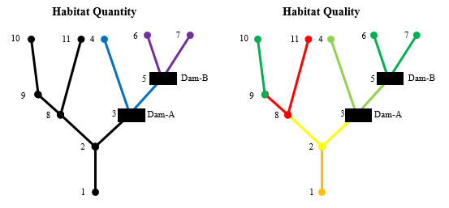

# WUCT
Watershed-Scale Upstream Connectivity Toolkit

## Overview

WUCT quantifies benefits associated with removal of organism movement barriers within a watershed (e.g., dam removal, culvert repair, fish ladder installation) or impacts of barrier addition (e.g., dam construction, weir installation). The model focuses on upstream movement of migratory organisms such as fish and is intended for application at the watershed-scale. The algorithm is based on four primary components: habitat quantity upstream of a dam, habitat quality upstream of a dam, the passability of a structure for a given organism, and the shape/topology of the watershed. This algorithm combines these data to estimate quality-weighted, accessible habitat at the watershed scale. This model documentation is intented for the U.S. Army Corps of Engineers (USACE) model certification process and details the development, technical details, and application of this adaptable modeling framework.

------------------------------------------------------------------------

## Read the Report
[Watershed-Scale Upstream Connectivity Toolkit](./WUCT_EcoMod_2018-09-19.Rmd)

------------------------------------------------------------------------

## Point of Contact

-   [Kyle McKay](mailto:Kyle.McKay@usace.army.mil), Research Civil
    Engineer, Engineer Research and Development Center, Environmental
    Laboratory, U.S. Army Corps of Engineers
    <a itemprop="sameAs" content="https://orcid.org/0000-0003-2703-3841" href="https://orcid.org/0000-0002-1465-5927" target="orcid.widget" rel="me noopener noreferrer" style="vertical-align:top;">
    https://orcid.org/0000-0003-2703-3841</a>

------------------------------------------------------------------------

## Acknowledgements

-   This toolkit was submitted as a planning model to the Ecosystem Restoration Planning Center of Expertise (ECO-PCX) in July 2018 and reviewed by Michael Dougherty (USACE Rock Island District) and Clayton Ridenour (Omaha District). Review comments and responses are included in Appendix C of this document. Final approval of this model for national certification was given in October 2018. 

-   Prior versions of this toolkit included input from Jock Conyngham, Craig Fischenich, John Schramski, Molly Reif, Diana Kohtio, Tom Prebyl, and other co-authors.

-   This model was developed over time with funding through multiple projects. An initial model supported the USACE Sacramento District Truckee Meadows Flood Control Project, which was developed with input from Jock Conyngham, Craig Fischenich, Leigh Skaggs, and Dan Artho. The model was generalized with support from the Ecosystem Management and Restoration Research Program (EMRRP), and John Schramski was crucial to this expansion. Applications of this model framework were also used in Proctor Creek, Georgia (with Tom Prebyl, Brian Zettle, and others at Mobile District), Duck River, Tennesee (with Tom Prebyl), and the Hudson-Raritan Estuary (with Jock Conyngham, Molly Reif, and Diana Kohtio). Dozens of USACE and external reviewers and managers have improved this model and associated applications through input and review. This model certification document was supported by USACE New York Districts Hudson-Raritan Estuary and Hudson River Habitat restoration programs. The project manager for these projects is Ms.Lisa Baron, and the environmental lead for these efforts is Mr.Peter Weppler. Input and funding from these diverse sources over the course of 10+ years is greatly appreciated and acknowledged.
